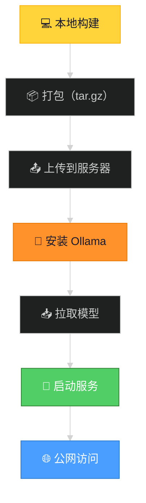

# 部署教程：从零到 AnyDev 云服务器

> 适用人群：后端小白，不太懂服务器、部署这些概念  
> 目标：把本地的 Chat AI 项目部署到远程云服务器上，让别人也能访问

---

## 目录

1. [先搞懂几个基础概念](#一先搞懂几个基础概念)
2. [项目架构：本地 vs 远程有什么区别](#二项目架构本地-vs-远程有什么区别)
3. [部署全流程概览](#三部署全流程概览)
4. [第一步：编译后端（交叉编译）](#四第一步编译后端交叉编译)
5. [第二步：构建前端](#五第二步构建前端)
6. [第三步：让后端能 serve 前端](#六第三步让后端能-serve-前端)
7. [第四步：打包上传](#七第四步打包上传)
8. [第五步：远程安装 Ollama 和模型](#八第五步远程安装-ollama-和模型)
9. [第六步：启动服务](#九第六步启动服务)
10. [常见问题排查](#十常见问题排查)

---

## 一、先搞懂几个基础概念

### 1.1 "部署"到底是啥？

大白话：**把你电脑上能跑的代码，搬到另一台电脑上也能跑，而且别人能通过网络访问到。**

```
你的 MacBook（本地）          远程服务器（云端）
┌──────────────────┐          ┌──────────────────┐
│  代码在这里       │   搬过去  │  代码在这里        │
│  localhost:8000  │  ──────▶  │  21.6.x.x:8000   │
│  只有你能访问     │          │  任何人都能访问     │
└──────────────────┘          └──────────────────┘
```

### 1.2 服务器是什么？

就是一台 **24 小时不关机的电脑**，放在机房或者云平台上。和你的 MacBook 唯一的区别：

- 它一直开着，不会休眠
- 它有公网 IP，别人能通过这个 IP 找到它
- 它通常没有图形界面，只有命令行

### 1.3 端口（Port）是什么？

可以理解为"房间号"。一台服务器就像一栋楼，每个端口是楼里的一个房间：

```
服务器 IP: 21.6.98.197
├── 22 号房：SSH（远程登录用）
├── 80 号房：Nginx（网站默认端口）
└── 8000 号房：我们的聊天应用
```

### 1.4 进程（Process）是什么？

运行中的程序。你的 Go 后端本质上是一个编译好的可执行文件，当你运行它时，就创建了一个**进程**。关掉进程，服务就停了。

```bash
# 启动进程（前台运行，关终端就停）
./chat-ai-server

# 后台运行（关终端也不停）
nohup ./chat-ai-server &
```

### 1.5 交叉编译是什么？

**你的 Mac 和云服务器是两种不同的电脑**：

| | 你的 MacBook | 云服务器 |
|------|:---:|:---:|
| CPU 架构 | Apple Silicon (ARM64) | Intel/AMD (x86_64) |
| 操作系统 | macOS (Darwin) | Linux |

在 Mac 上编译出来的程序，放到 Linux 服务器上跑不了。所以需要**交叉编译**——在 Mac 上编译出能在 Linux 上运行的程序：

```bash
GOOS=linux GOARCH=amd64 go build -o chat-ai-server .
#     ↑              ↑
#   目标系统      目标CPU
```

> Go 语言天生支持交叉编译，只需要改两个环境变量。如果是 Python / Node.js，就不需要交叉编译（它们是解释执行），但需要在服务器上装对应运行时。

---

## 二、项目架构：本地 vs 远程有什么区别

### 本地开发时

```
┌──── 你的 MacBook ────────────────────────────┐
│                                                │
│  终端1: ollama serve          (端口 11434)      │
│  终端2: go run .              (端口 8000)       │
│  终端3: npm run dev            (端口 5173)      │
│                                                │
│  浏览器访问 http://localhost:5173               │
│  前端通过 Vite proxy 把 /api 请求转发给 :8000    │
│  后端通过 HTTP 调 :11434 的 Ollama              │
└────────────────────────────────────────────────┘
```

### 部署到服务器后

```
┌──── 云服务器 (21.6.98.197) ───────────────────┐
│                                                │
│  ollama serve                    (后台运行)     │
│  ./chat-ai-server                (后台运行)     │
│       │                                        │
│       ├── API:  :8000/api/*                    │
│       └── 前端: :8000/         (静态文件)       │
│                                                │
│  用户浏览器访问 http://21.6.98.197:8000         │
│  所有请求都走 :8000，不需要 Vite proxy 了       │
└────────────────────────────────────────────────┘
```

### 关键区别

| | 本地 | 服务器 |
|------|------|------|
| 前端 | `npm run dev`（Vite 开发服务器） | 静态文件直接由 Go 后端 serve |
| 代理 | Vite 把 `/api` 转发给 `:8000` | 不需要，前端和后端在同一个端口 |
| 进程管理 | 手动开三个终端 | 全部后台运行 (`nohup ... &`) |
| 访问方式 | `localhost:5173` | 公网 IP + 端口 |

---

## 三、部署全流程概览



每一步做了什么：

| 步骤 | 在哪儿做 | 具体干嘛 |
|------|:---:|------|
| ① 交叉编译后端 | 本机 | 编译出能在 Linux 上跑的 Go 二进制 |
| ② 构建前端 | 本机 | `npm run build`，产出纯静态 HTML/JS/CSS |
| ③ 合并打包 | 本机 | 把后端程序 + 前端文件 + 知识库压缩成 `.tar.gz` |
| ④ 上传 | 本机→服务器 | 通过 AnyDev 把压缩包传到服务器 |
| ⑤ 安装 Ollama | 服务器 | 一键安装脚本 |
| ⑥ 拉取模型 | 服务器 | `ollama pull` 下载对话模型和向量模型 |
| ⑦ 解压启动 | 服务器 | 解压 → 运行后端 → 灌知识库 |
| ⑧ 访问 | 浏览器 | 访问 `http://服务器IP:8000` |

---

## 四、第一步：编译后端（交叉编译）

Go 项目在 `backend/` 目录，只有 3 个 `.go` 文件。

```bash
cd backend

# macOS 本地编译（在你的 Mac 上直接跑）
go build -o chat-ai-server .

# Linux 交叉编译（部署到服务器用）
GOOS=linux GOARCH=amd64 go build -o chat-ai-server .
```

两条命令的区别只有环境变量：
- `GOOS=linux` — 告诉 Go："你要编译出来的程序是给 Linux 用的"
- `GOARCH=amd64` — 告诉 Go："目标 CPU 是 x86_64（Intel/AMD）"

编译结果是一个 **21MB 的单个文件** `chat-ai-server`，不需要任何依赖（Go 是静态编译，所有依赖都打包进这个文件了）。

---

## 五、第二步：构建前端

前端是 Vue 3 + Vite 项目，在 `frontend/` 目录。

```bash
cd frontend

# 开发模式（本地用）
npm run dev              # 启动 Vite 开发服务器，支持热更新

# 构建模式（部署用）
npm run build            # 产出 dist/ 目录，里面是纯静态文件
```

**开发模式 vs 构建模式的区别**：

| | `npm run dev` | `npm run build` |
|------|------|------|
| 文件 | 源码，无数个小文件 | 压缩合并后的几个文件 |
| 速度 | 热更新，秒级 | 一次性构建，3 秒 |
| 大小 | ~200MB（含 node_modules） | ~2MB |
| 部署 | ❌ 不能直接部署 | ✅ 可以部署 |

---

## 六、第三步：让后端能 serve 前端

本地开发时，前端跑在 `localhost:5173`，后端跑在 `localhost:8000`，是分开的。Vite 自动把前端的 `/api/*` 请求代理到 8000 端口。

部署时没有 Vite 了，需要让**后端直接提供前端文件**。

在 `backend/main.go` 里加两行：

```go
// 如果用户访问的不是 /api/*，就返回 index.html（SPA 路由）
r.NoRoute(func(c *gin.Context) {
    c.File("static/index.html")
})

// /assets/* 路径映射到 static/assets/ 目录
r.Static("/assets", "static/assets")
```

原理很简单：用户访问 `http://服务器:8000/` 时，Go 直接返回 `static/index.html`。浏览器解析这个 HTML，发现里面引用了 `/assets/xxx.js`，又向 Go 发请求，Go 从 `static/assets/` 目录读取并返回。

**目录结构**：

```
项目根目录/
├── chat-ai-server       ← Go 编译的二进制
├── static/              ← 前端构建产物
│   ├── index.html
│   └── assets/
│       ├── xxx.js
│       └── xxx.css
└── data/
    ├── docs/            ← 知识库文档
    └── index/           ← 向量索引（自动生成）
```

---

## 七、第四步：打包上传

把编译好的文件组织到一起，压缩传输。

```bash
# 1. 创建部署目录，放入所有需要的文件
mkdir -p deploy
cp backend/chat-ai-server deploy/     # Go 二进制
cp -r frontend/dist deploy/static     # 前端文件 → static/ 目录
cp -r backend/data deploy/            # 知识库文档
mkdir -p deploy/data/index            # 空目录，向量索引将存这里

# 2. 打包
tar czf deploy.tar.gz -C deploy .

# 3. 上传到 AnyDev（通过 IDE 集成或命令行）
```

**`tar czf` 命令拆解**：

```
tar czf deploy.tar.gz -C deploy .
 ↑  ↑↑↑              ↑↑       ↑
 │  │││               ││       └── 打包目录里的所有文件
 │  │││               │└── 切换到 deploy 目录操作
 │  │││               └── 打包文件名
 │  ││└── f = file，输出到文件
 │  │└── z = gzip 压缩
 │  └── c = create 创建新压缩包
 └── 命令名
```

---

## 八、第五步：远程安装 Ollama 和模型

### 安装 Ollama

```bash
# 一键安装（官方脚本）
curl -fsSL https://ollama.com/install.sh | sh
```

这条命令做了什么：
1. 下载 Ollama 的 Linux 安装包
2. 解压到 `/usr/local/`
3. 创建 `ollama` 用户（安全起见，不用 root 跑）
4. 启动 Ollama 服务

### 后台启动 Ollama

```bash
# 后台运行，日志写入文件
nohup ollama serve > ollama.log 2>&1 &
```

命令拆解：
- `nohup` — "no hang up"，关掉终端也不终止进程
- `ollama serve` — 启动 Ollama API 服务（默认端口 11434）
- `> ollama.log` — 标准输出写到这个文件
- `2>&1` — 错误输出也合并到同一个文件
- `&` — 放到后台运行，不阻塞当前终端

### 拉取模型

```bash
ollama pull nomic-embed-text    # 向量模型，~270MB，1 分钟
ollama pull qwen3:8b            # 对话模型，~4.9GB，3-5 分钟
```

> 拉模型就是下载模型文件。和 `npm install` 下载依赖包一个道理。

---

## 九、第六步：启动服务

### 9.1 解压上传的压缩包

```bash
cd /data
tar xzf deploy.tar.gz -C chat-ai/
```

### 9.2 后台启动 Go 后端

```bash
cd /data/chat-ai
nohup ./chat-ai-server > server.log 2>&1 &
```

### 9.3 验证服务是否正常

```bash
# 检查进程是否在运行
ps aux | grep chat-ai

# 检查端口是否在监听
curl http://localhost:8000/api/health
```

正常输出：

```json
{
  "ollama": "connected",
  "chat_model": "qwen3:8b",
  "embed_model": "nomic-embed-text",
  "docs_count": 0,
  "top_k": 3
}
```

### 9.4 灌入知识库（向量化文档）

```bash
curl -XPOST http://localhost:8000/api/ingest
```

这一步会：
1. 读取 `data/docs/` 下的 `.md` 文件
2. 按 400 字符切分成文本块
3. 每个文本块调用 Ollama 的 Embedding API 生成向量
4. 向量 + 原文存入向量库

### 9.5 最终验证

```bash
# 再次检查健康状态
curl http://localhost:8000/api/health
# 此时 docs_count 应该是 7（2 个文档切出来的块数）

# 测试 RAG 对话
curl "http://localhost:8000/api/chat/stream?message=我们组代号是什么？&use_rag=true"
```

---

## 十、常见问题排查

### 10.1 进程突然挂了怎么看日志？

```bash
# 看最后的日志
tail -50 /data/chat-ai/server.log

# 实时监控日志
tail -f /data/chat-ai/server.log
```

### 10.2 Ollama 拉模型失败？

```bash
# 检查 Ollama 是否在运行
curl http://localhost:11434/api/tags

# 检查已安装的模型
ollama list

# 重启 Ollama
pkill ollama
nohup ollama serve > ollama.log 2>&1 &
```

### 10.3 知识库灌入报错 "couldn't create embedding"

说明 Ollama 没有正常启动，或者 Embedding 模型没拉下来。

```bash
# 确认模型存在
ollama list | grep nomic-embed-text

# 确认 Ollama 可访问
curl http://localhost:11434/api/tags
```

### 10.4 页面能打开但聊天没反应？

按 F12 打开浏览器控制台，看 Network 标签：
- 如果 `/api/health` 返回 200 → 后端正常
- 如果 `ollama: "disconnected"` → Ollama 没启动
- 如果 `/api/chat/stream` 卡住 → LLM 模型可能正在加载（首次请求较慢）

### 10.5 知识库更新了怎么办？

```bash
# 1. 替换 data/docs/ 下的文件
# 2. 重新灌库
curl -XPOST http://localhost:8000/api/ingest
# 3. 刷新浏览器，新知识就生效了
```

不需要重启服务，不需要重新拉模型。

---

## 附录：部署相关命令速查

| 命令 | 作用 |
|------|------|
| `ps aux \| grep chat-ai` | 查看后端进程是否在运行 |
| `pkill chat-ai-server` | 停掉后端进程 |
| `nohup ./chat-ai-server > server.log 2>&1 &` | 后台启动后端 |
| `tail -f server.log` | 实时看日志 |
| `curl localhost:8000/api/health` | 检查后端健康状态 |
| `curl -XPOST localhost:8000/api/ingest` | 重新灌入知识库 |
| `ollama list` | 查看已安装的模型 |
| `ollama pull <模型名>` | 下载模型 |
| `netstat -tlnp \| grep 8000` | 查看 8000 端口是否在监听 |

---

> **总结**：部署就是把本地代码编译→打包→上传→启动的过程。Go 的交叉编译让你在 Mac 上就能编译出 Linux 程序，`nohup` 让程序在后台一直跑，`tar` 压缩传输文件。从代码写完到别人能访问，只需要这几步。
